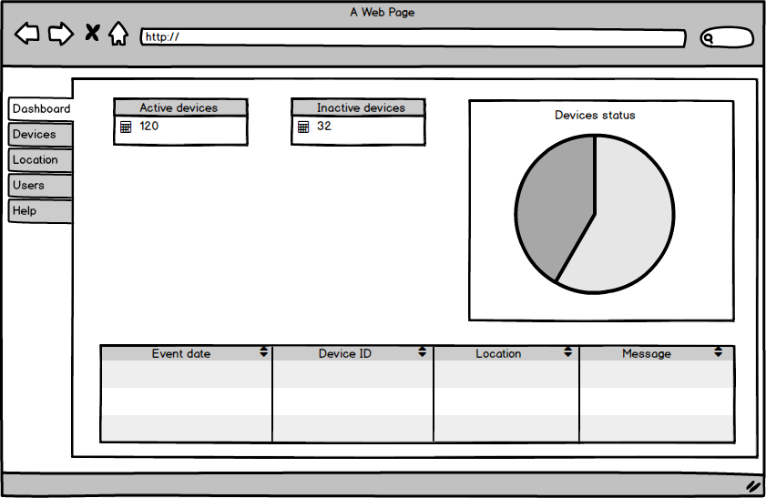
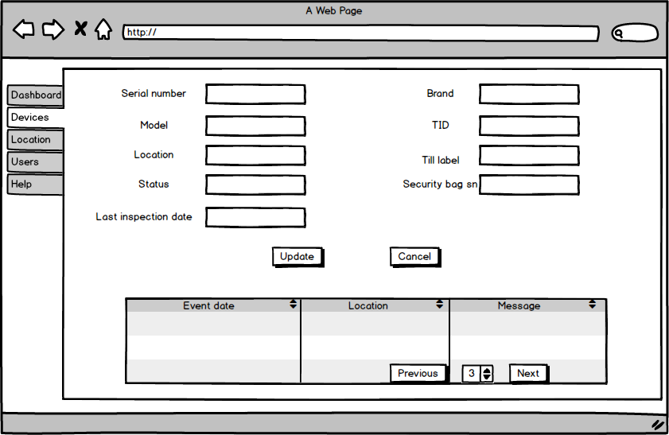
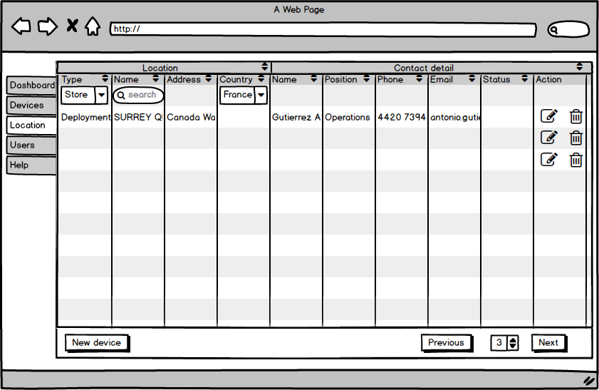
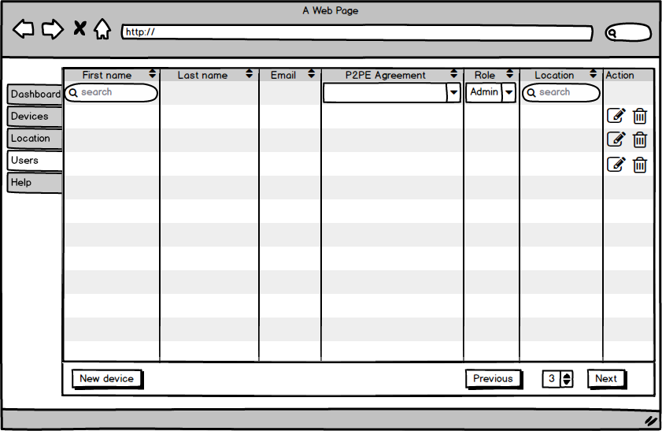

[TOC]#Mockup for admin

>1.First page for admin user.

>2.Second tab for list of devices, we can search each element with filter block, in the action, we can edit or delete row.

>2.1.Click , there is all the details of one device, we can update or return last page.

>3.Third tab for list of locations, we can search each location with filter block, in the action, we can edit or delete row.

>3.1.Click , there is all the details of one location, we can update or return last page.

>4.Fourth tab for list of users, we can search each user with filter block, in the action, we can edit or delete row.

>4.1.Click , there is all the details of one user, we can update or return last page.

>5.Fifth tab for help search.

