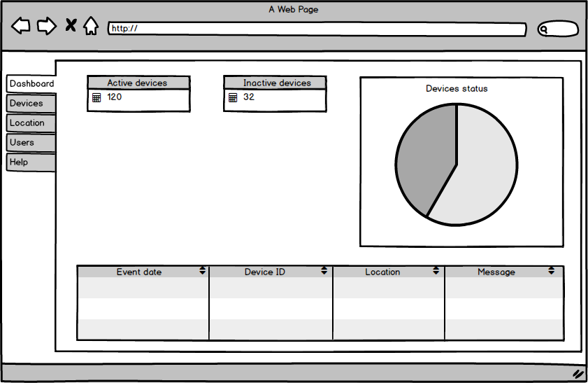
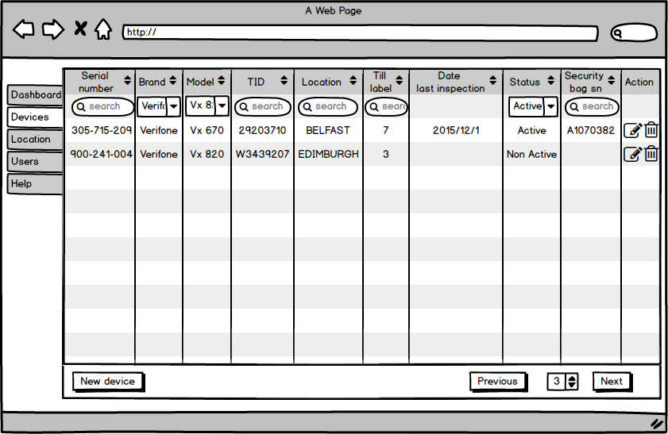
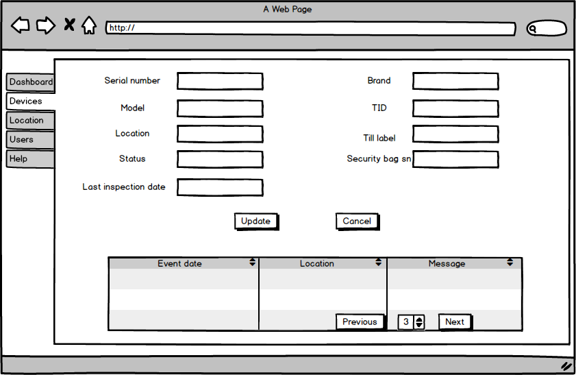
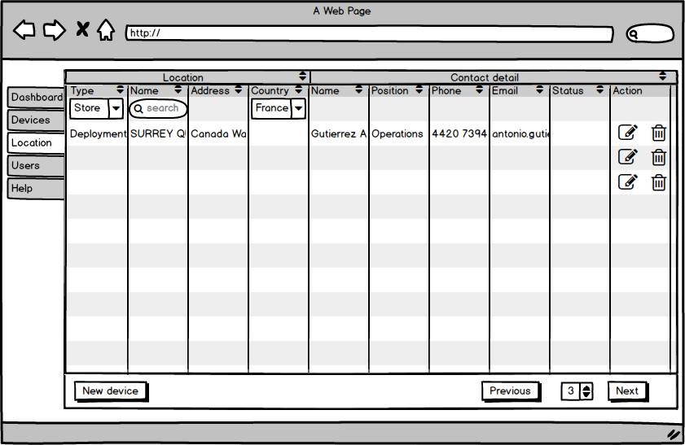
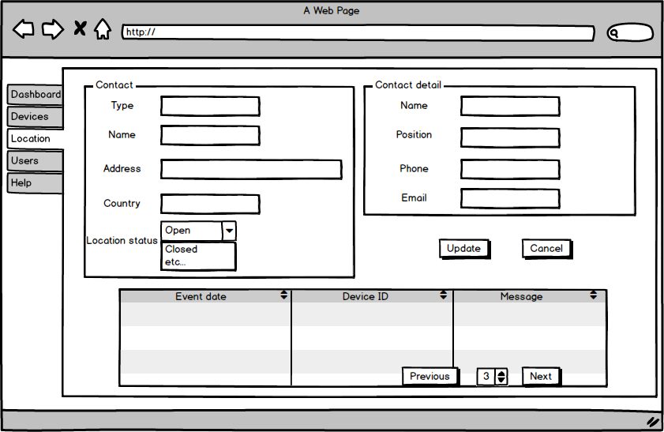
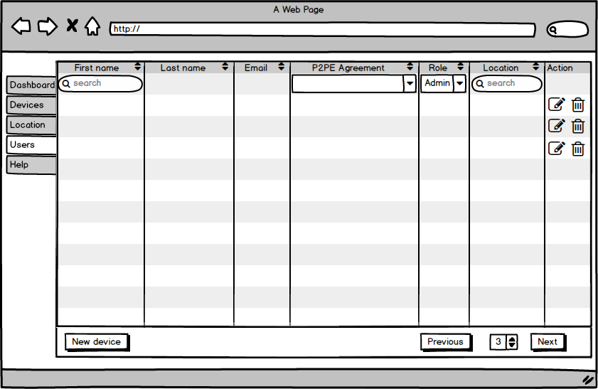
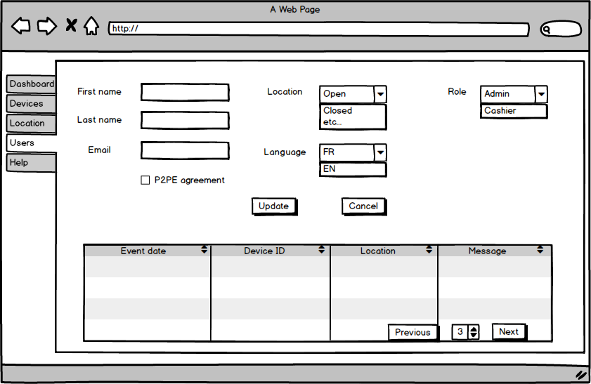
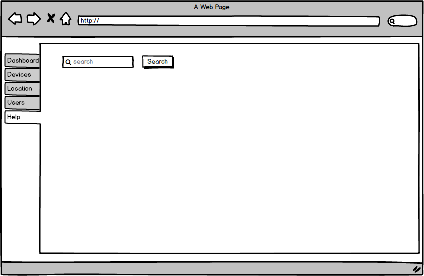
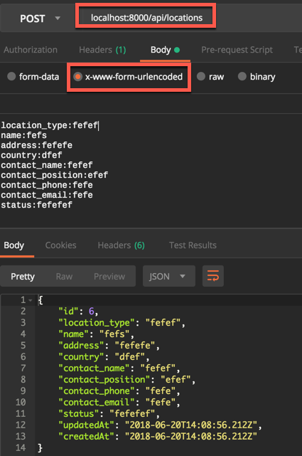
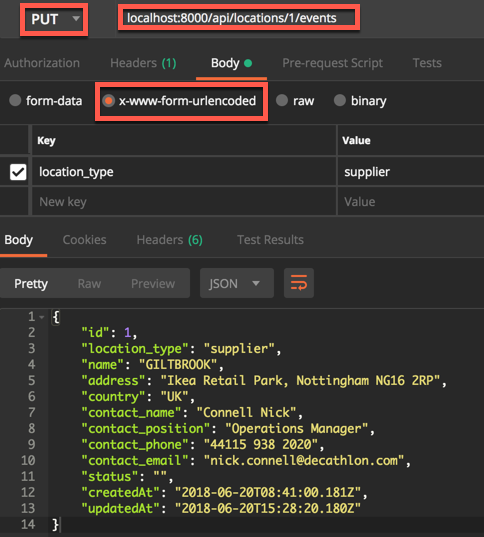

**Table of Contents**  *generated with [DocToc](https://github.com/thlorenz/doctoc)*
<!-- START doctoc generated TOC please keep comment here to allow auto update -->
<!-- DON'T EDIT THIS SECTION, INSTEAD RE-RUN doctoc TO UPDATE -->


- [Mockup for admin](#mockup-for-admin)
- [PostgreSQL Database](#postgresql-database)
- [API backend](#api-backend)
  - [list of locations:](#list-of-locations)
  - [create new location:](#create-new-location)
  - [retrieve one location by id](#retrieve-one-location-by-id)
  - [update one location by id](#update-one-location-by-id)
  - [retreive events depends on one location](#retreive-events-depends-on-one-location)

<!-- END doctoc generated TOC please keep comment here to allow auto update -->

# Mockup for admin

>1.First page for <span style="color:red; font-family:Georgia; font-size:2em;">admin user</span>.



>2.Second tab for list of devices, we can search each element with filter block, in the action, we can edit or delete row.



>2.1.Click , there is all the details of one device, we can update or return last page.



>3.Third tab for list of locations, we can search each location with filter block, in the action, we can edit or delete row.



>3.1.Click , there is all the details of one location, we can update or return last page.



>4.Fourth tab for list of users, we can search each user with filter block, in the action, we can edit or delete row.



>4.1.Click , there is all the details of one user, we can update or return last page.



>5.Fifth tab for help search.



# PostgreSQL Database

>1.Modify config/config.json

>2.Create database
```
./node_modules/.bin/sequelize db:create   
```
>3.Create tables
```
./node_modules/.bin/sequelize db:migrate       
```

>4.Run seed
```
./node_modules/.bin/sequelize db:seed:all
```

# API backend
*Test with [Postman](https://www.getpostman.com/)* 
## list of locations:
[get] /api/locations
> response example:
````
[
    {
        "id": 1,
        "location_type": "store",
        "name": "GILTBROOK",
        "address": "Ikea Retail Park, Nottingham NG16 2RP",
        "country": "UK",
        "contact_name": "Connell Nick",
        "contact_position": "Operations Manager",
        "contact_phone": "44115 938 2020",
        "contact_email": "nick.connell@decathlon.com",
        "status": "",
        "createdAt": "2018-06-20T08:41:00.181Z",
        "updatedAt": "2018-06-20T08:41:00.181Z"
    }
]
````

## create new location:
[post] /api/locations
> Request example:
```
location_type:fefef
name:fefs
address:fefefe
country:dfef
contact_name:fefef
contact_position:efef
contact_phone:fefe
contact_email:fefe
status:fefefef
```


## retrieve one location by id
[get] /api/locations/:id
> Response example:
```
{
    "id": 1,
    "location_type": "store",
    "name": "GILTBROOK",
    "address": "Ikea Retail Park, Nottingham NG16 2RP",
    "country": "UK",
    "contact_name": "Connell Nick",
    "contact_position": "Operations Manager",
    "contact_phone": "44115 938 2020",
    "contact_email": "nick.connell@decathlon.com",
    "status": "",
    "createdAt": "2018-06-20T08:41:00.181Z",
    "updatedAt": "2018-06-20T08:41:00.181Z"
}
```

## update one location by id
[put] /api/locations/:id
> Request & Response example:



## retreive events depends on one location
[get] /api/locations/:id/events
